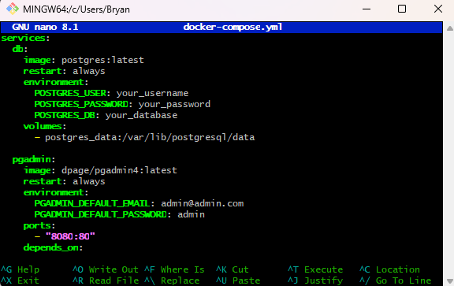
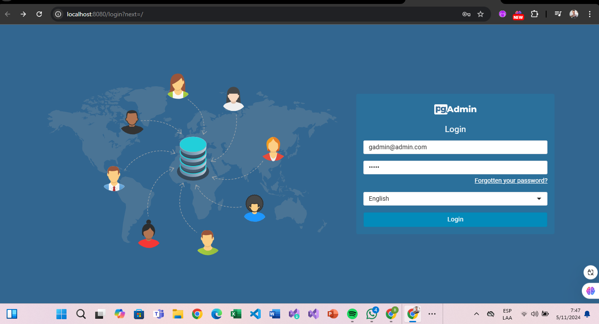
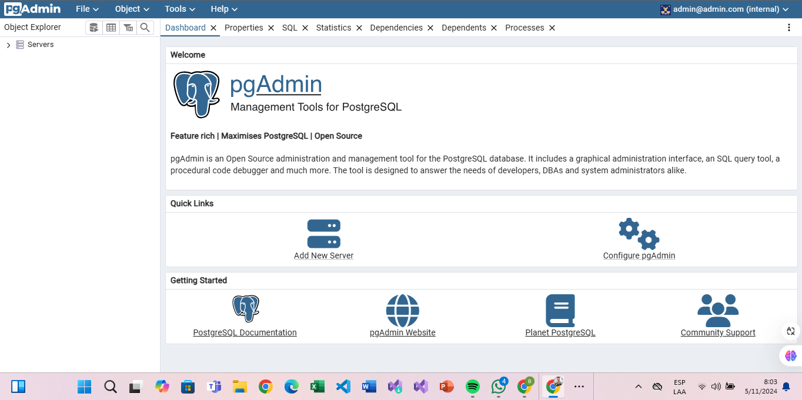

# Informe sobre Docker

## ¿Qué es Docker?

Docker es una plataforma de software que permite crear, desplegar y ejecutar aplicaciones en contenedores. Un contenedor es una unidad estandarizada que agrupa todo lo necesario para ejecutar una aplicación, incluyendo el código, las bibliotecas, las dependencias y el sistema operativo. Esto permite que las aplicaciones se ejecuten de manera consistente en diferentes entornos, desde el desarrollo hasta la producción.

## ¿Para qué sirve Docker?

Docker ofrece varias ventajas que lo hacen útil para desarrolladores y equipos de `devops`:

1. **Portabilidad**: Los contenedores Docker pueden ejecutarse en cualquier sistema que tenga Docker instalado, lo que asegura que las aplicaciones funcionen de la misma manera en diferentes entornos.

2. **Docker Hub**: Es un servicio en la nube que permite almacenar y compartir imágenes de contenedores. Es un repositorio público donde los usuarios pueden encontrar y utilizar imágenes de aplicaciones.

## Conocimientos Previos

Para abordar este tema, es fundamental contar con algunos conocimientos previos. Primero, es importante entender los conceptos básicos relacionados con los contenedores y la plataforma Docker. También se requiere una familiaridad con la terminal de comandos, ya que muchas operaciones se ejecutarán a través de esta interfaz.

Adicionalmente, es útil tener un entendimiento de los conceptos de red, especialmente en lo que respecta al `mapeo` de `puertos`, ya que esto permite la comunicación entre el `host` y los contenedores. Por último, se debe conocer la estructura y la sintaxis de los `archivos YAML`, que son cruciales para la configuración de `docker compose`.

## Objetivos

Los objetivos de este informe son claros y se centran en proporcionar un entendimiento práctico de Docker. En primer lugar, se busca comprender la estructura y la configuración de un archivo `docker-compose.yml`, lo que permitirá organizar y gestionar múltiples contenedores de manera eficiente.

Además, se pretende configurar servicios de bases de datos y herramientas de administración, como `postgresql` y `pgadmin`, en un entorno Docker. Esto facilitará el manejo de datos y la administración de bases de datos en contenedores.

Otro objetivo es aprender a ejecutar servicios en segundo plano utilizando `docker compose`, lo que es esencial para mantener las aplicaciones funcionando sin la necesidad de mantener la terminal abierta. Finalmente, se explorará el `mapeo` de `puertos` entre el `host` y los contenedores, una habilidad clave para acceder a las aplicaciones desplegadas en el entorno de Docker.

## Procedimiento

Una máquina o computadora con Docker y también tener instalado `docker compose`. Modificación de `archivos YAML` al momento de estar en el `gnu nano 8.1`.

## Paso 1: Creación del Archivo `docker-compose.yml`

Para comenzar a trabajar con `docker compose`, lo primero que debemos hacer es crear un archivo llamado `docker-compose.yml`. Este archivo es fundamental, ya que define la configuración y los servicios que queremos ejecutar en nuestros contenedores.

### Pasos para crear el archivo

1. **Abrir el editor de texto**: Utiliza tu editor de texto preferido (como Visual Studio Code, Sublime Text o cualquier otro) para crear un nuevo archivo.

   

2. **Nombrar el archivo**: Guarda el archivo con el nombre `docker-compose.yml`. Asegúrate de que la extensión sea `.yml`, ya que este formato es necesario para que `docker compose` lo reconozca. En cada servicio, tenemos varias variables de entorno y `mapeos` de `puertos`. Es importante porque las diferentes versiones pueden tener diferentes características y sintaxis. Un ejemplo común es:

   .

## Configuración del Servicio de PostgreSQL

Primero, en nuestro `archivo YAML`, configuramos el contenedor de `postgresql`. Es importante definir el nombre de usuario, la contraseña y la base de datos inicial que utilizaremos. Además, debemos configurar un volumen para asegurar que los datos se persistan, incluso si el contenedor se detiene.

## Configuración de pgAdmin

Luego, pasamos a configurar el servicio de `pgadmin` en el mismo archivo. Aquí, establecemos las credenciales de acceso que utilizaremos para iniciar sesión en `pgadmin`. También es esencial `mapear` el `puerto 8080` del `host` al `puerto 80` del contenedor, lo que nos permitirá acceder a la interfaz de `pgadmin` desde nuestro navegador.

   .

Luego ejecutamos el `docker-compose up -d` en la terminal, después de eso verificamos en segundo plano el estado de los contenedores con `docker ps`. Procedemos a probar la conexión de `pgadmin` de la siguiente manera con `http://localhost:8080` en el navegador. Damos inicio de sesión en `pgadmin` usando usuario y contraseñas correctas de nuestras credenciales. Realizamos una conexión al servidor `postgresql` configurado, luego verificando su conectividad.  

   

## Resultado

Como resultado exitoso tenemos el inicio de sesión esperado y la creación de los contenedores `pgadmin` y `db` a través del `host`, teniendo accesibilidad. Una conexión a los datos `postgresql`.

   

## Conclusión

Docker ha transformado la forma en que las aplicaciones se desarrollan y despliegan. Su capacidad para crear entornos consistentes y portátiles, junto con su eficiencia y facilidad de uso, lo convierte en una herramienta fundamental en el desarrollo de software moderno. Al adoptar Docker, los equipos pueden mejorar la colaboración, acelerar el ciclo de vida del desarrollo y optimizar la infraestructura.

## Conclusión

Docker se ha covertido en una arma útil para el desarrollo y despliegue de aplicaciones al ofrecer entornos consistentes y portátiles. Su facilidad de uso y eficiencia lo convierten en una herramienta clave para el desarrollo de software.

He observado que Docker mejora la colaboración entre equipos, ya que permite trabajar en el mismo entorno sin diferencias de configuración. Además, acelera el ciclo de vida del desarrollo, facilitando lanzamientos más rápidos. 

## Recursos adicionales

- [Sitio oficial de Docker](https://www.docker.com/)
- [Documentación de Docker](https://docs.docker.com/)
- [Docker Hub](https://hub.docker.com/)